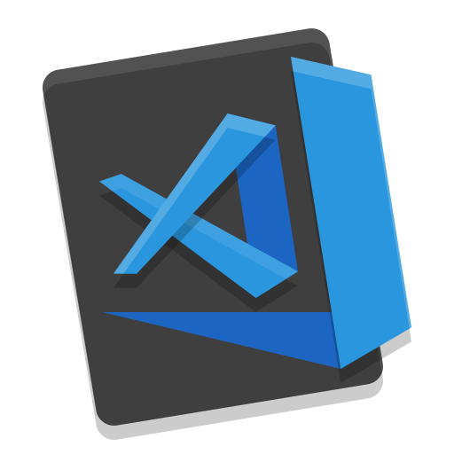

<h1 align="center">
 
  
 
 
Visual Studio - Electron
</h1>

In this code challenge, I developed an application that provides an easy way to open favorite projects in VSCode.

  

                          

## Features

- :electron: **Electron** — desktop apps with JavaScript, HTML, and CSS
- 🔺**Sentry** - cross platform application monitoring
- 💖**Lint** — ESlint, Prettier and EditorConfig

## Dependencies

- [Node.js](https://nodejs.org/en/) >= 8.0.0
- [Yarn](https://yarnpkg.com/pt-BR/docs/install)

## Getting started

1. Clone this repository;
2. `cd electron-tray`; 
3. Run `yarn` to install dependencies. 
4. Run `yarn start`.

